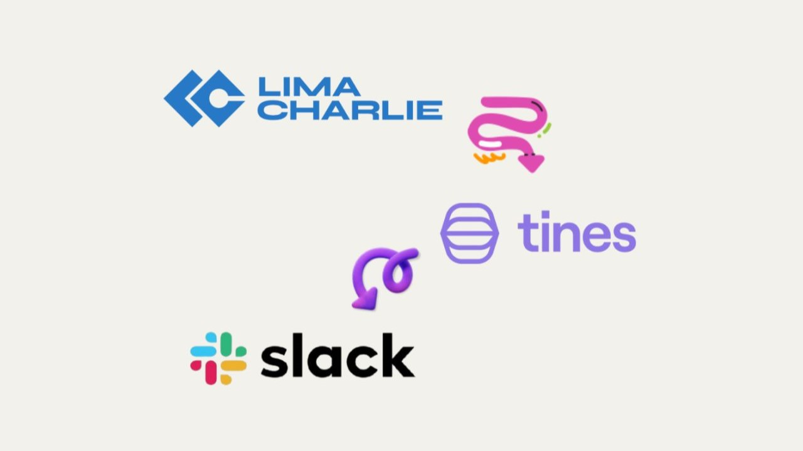

<div align="center">

# LimaCharlie EDR + Tines SOAR Home Lab



### Security Automation & Detection Engineering Portfolio

[](#project-status)
[](#technology-stack)
[](#technology-stack)
[](#detection-engineering)
[](#cost)

**Attack → Detect → Automate → Respond**

</div>

---

## Overview

This project is a **cloud-native Security Operations Center (SOC) home lab** demonstrating how endpoint detection, security alerting, workflow automation, and automated incident response can be integrated into a single security operations pipeline.

The lab combines:

* **LimaCharlie** for endpoint detection and telemetry
* **Tines** for SOAR workflow automation
* **Windows VM** as the monitored endpoint
* **LaZagne** for authorized credential-access attack simulation
* **Slack and Email** for analyst notifications
* **REST API automation** for endpoint containment
* **MITRE ATT&CK** for adversary behavior mapping

The resulting workflow demonstrates a practical SOC response lifecycle:

```text
┌──────────────────┐
│ Attack Simulation│
│    LaZagne       │
└────────┬─────────┘
         │
         ▼
┌──────────────────┐
│ Windows Endpoint │
│      Sensor      │
└────────┬─────────┘
         │ Telemetry
         ▼
┌──────────────────┐
│   LimaCharlie    │
│ Detection Engine │
└────────┬─────────┘
         │ Alert
         ▼
┌──────────────────┐
│      Tines       │
│   SOAR Workflow  │
└────────┬─────────┘
         │
    ┌────┴────────────────────┐
    ▼                         ▼
┌──────────┐            ┌──────────┐
│  Notify  │            │ Analyze  │
│  Analyst │            │  Alert   │
└────┬─────┘            └────┬─────┘
     │                       │
     └──────────┬────────────┘
                ▼
       ┌─────────────────┐
       │ Automated       │
       │ Containment     │
       └────────┬────────┘
                │
                ▼
       ┌─────────────────┐
       │ Isolate Endpoint│
       └─────────────────┘
```

The lab focuses on a core SOC engineering objective:

> **Reduce the time between detection and containment by automating repetitive response actions while maintaining analyst visibility.**

---

# Objectives

The primary objectives of this project were to:

* Deploy an EDR sensor to a Windows endpoint.
* Collect and validate endpoint telemetry.
* Create custom detection logic.
* Map detections to MITRE ATT&CK.
* Forward security alerts into a SOAR platform.
* Build an automated incident-response workflow.
* Notify analysts through multiple channels.
* Trigger automated endpoint containment.
* Integrate REST APIs into a security automation workflow.
* Measure the response time from detection to containment.
* Build the entire lab using free/community resources.

---

# Architecture

## High-Level Architecture

```text
                         ┌─────────────────────┐
                         │   Attack Simulation  │
                         │       LaZagne        │
                         └──────────┬──────────┘
                                    │
                                    ▼
                         ┌─────────────────────┐
                         │    Windows VM       │
                         │                     │
                         │ LimaCharlie Sensor  │
                         └──────────┬──────────┘
                                    │
                              Endpoint Telemetry
                                    │
                                    ▼
                         ┌─────────────────────┐
                         │     LimaCharlie     │
                         │                     │
                         │ Detection & Response│
                         │       Rules         │
                         └──────────┬──────────┘
                                    │
                                  Alert
                                    │
                                    ▼
                         ┌─────────────────────┐
                         │       Tines         │
                         │        SOAR         │
                         │                     │
                         │ Webhook             │
                         │    ↓                │
                         │ Slack               │
                         │    ↓                │
                         │ Email               │
                         │    ↓                │
                         │ Prompt / Decision   │
                         │    ↓                │
                         │ REST API             │
                         └──────────┬──────────┘
                                    │
                                    ▼
                         ┌─────────────────────┐
                         │ Endpoint Isolation  │
                         │    via API          │
                         └─────────────────────┘
```

---

# Attack Scenario

The lab uses **LaZagne** to simulate credential-access activity against the Windows test endpoint.

The activity is performed inside an isolated, authorized lab environment for the purpose of validating:

1. Endpoint telemetry collection
2. Detection logic
3. Alert generation
4. SOAR integration
5. Automated response
6. Endpoint containment

The simulated behavior is mapped to:

**MITRE ATT&CK T1555 — Credentials from Password Stores**

This provides a realistic security-operations scenario without requiring a production environment.

---

# Detection Engineering

The detection layer is implemented using **LimaCharlie Detection & Response rules**.

The objective is not simply to generate an alert, but to create a detection that produces useful telemetry for downstream automation.

### Detection Pipeline

```text
Process Activity
       │
       ▼
LimaCharlie Telemetry
       │
       ▼
Detection Rule
       │
       ├── Match
       │
       ▼
Security Event
       │
       ▼
Tines Webhook
```

### MITRE ATT&CK Mapping

| Technique                        | ID    | Purpose                           |
| -------------------------------- | ----- | --------------------------------- |
| Credentials from Password Stores | T1555 | Detect credential-access behavior |

The project can be extended with additional ATT&CK techniques and detection rules as the lab evolves.

---

# SOAR Automation

The Tines workflow is the core automation component of the project.

The implemented workflow consists of five primary stages:

```text
1. Webhook
      ↓
2. Slack Notification
      ↓
3. Email Notification
      ↓
4. Prompt / Decision Logic
      ↓
5. Endpoint Isolation
```

## 1. Alert Ingestion

LimaCharlie forwards the security event to Tines through a webhook.

```text
LimaCharlie
     │
     │ HTTP/Webhook
     ▼
   Tines
```

---

## 2. Analyst Notification

Once the alert reaches Tines, notification actions are triggered.

The workflow can notify the security team through:

* Slack
* Email

This provides immediate visibility into the incident.

---

## 3. Automated Decision Stage

The workflow evaluates the received security event and determines whether the configured response action should be executed.

This demonstrates how SOAR platforms can move beyond simple alert forwarding and perform conditional security workflows.

---

## 4. Endpoint Containment

When the response condition is satisfied, Tines invokes the LimaCharlie REST API.

```text
Tines
  │
  │ REST API
  ▼
LimaCharlie
  │
  ▼
Endpoint Isolation
```

The endpoint can then be isolated from the network to prevent further malicious activity.

---

# Incident Response Lifecycle

The completed lab demonstrates the following SOC lifecycle:

| Phase        | Implementation               |
| ------------ | ---------------------------- |
| Attack       | LaZagne simulation           |
| Telemetry    | LimaCharlie endpoint sensor  |
| Detection    | LimaCharlie D&R rule         |
| Alerting     | LimaCharlie → Tines          |
| Notification | Slack + Email                |
| Decision     | Tines workflow               |
| Response     | LimaCharlie REST API         |
| Containment  | Endpoint isolation           |
| Verification | Endpoint response validation |

This creates a complete **Detect → Investigate → Respond → Contain** workflow.

---

# Results

The lab successfully demonstrated:

* **EDR telemetry collection** from a Windows endpoint.
* **Custom detection engineering** using LimaCharlie.
* **MITRE ATT&CK mapping** for credential-access behavior.
* **Automated alert ingestion** into Tines.
* **Multi-channel security notifications**.
* **REST API-based response automation**.
* **Automated endpoint isolation**.
* **Sub-60-second incident response** during the demonstrated scenario.
* A complete lab implementation using **$0-cost/free-tier resources**.

The original project implementation records these as completed achievements, including verified Windows telemetry, the five-step SOAR workflow, REST API isolation, and sub-60-second response time.

---

# Technology Stack

| Category          | Technology       | Role                                    |
| ----------------- | ---------------- | --------------------------------------- |
| EDR               | **LimaCharlie**  | Endpoint telemetry and detection        |
| SOAR              | **Tines**        | Security automation and orchestration   |
| Attack Simulation | **LaZagne**      | Authorized credential-access simulation |
| Endpoint          | **Windows VM**   | Monitored security endpoint             |
| Notification      | **Slack**        | Real-time alert notification            |
| Notification      | **Email**        | Incident notification                   |
| API               | **REST API**     | Automated containment                   |
| Framework         | **MITRE ATT&CK** | Adversary behavior mapping              |

The project was implemented using the free/community tiers available for the lab environment.

---

# Lab Environment

```text
┌──────────────────────────────────────┐
│           Windows Test VM            │
│                                      │
│       LimaCharlie Sensor             │
│              │                       │
│              ▼                       │
│       Endpoint Telemetry             │
└──────────────┬───────────────────────┘
               │
               │ Internet
               ▼
┌──────────────────────────────────────┐
│            LimaCharlie               │
│                                      │
│ Detection & Response                 │
└──────────────┬───────────────────────┘
               │
               │ Webhook
               ▼
┌──────────────────────────────────────┐
│               Tines                  │
│                                      │
│        SOAR Automation               │
└──────────────┬───────────────────────┘
               │
               │ API
               ▼
┌──────────────────────────────────────┐
│        LimaCharlie Endpoint          │
│                                      │
│          Isolation / Containment      │
└──────────────────────────────────────┘
```

---

# Documentation & Evidence

The repository should contain screenshots and documentation demonstrating each major stage of the lab.

Recommended evidence:

### Endpoint Telemetry

Show the Windows endpoint registered and reporting telemetry to LimaCharlie.

### Detection

Show the custom detection rule and the resulting security event.

### Tines Workflow

Show the complete SOAR workflow:

```text
Webhook
   ↓
Slack
   ↓
Email
   ↓
Prompt
   ↓
Isolation
```

### Containment

Show the endpoint isolation action and its resulting state.

### Incident Timeline

Where possible, document timestamps demonstrating the time between:

```text
Attack
  ↓
Detection
  ↓
Alert
  ↓
Automation
  ↓
Containment
```

This makes the project much more valuable as a SOC portfolio artifact because it demonstrates **measurable operational performance**, not just tool configuration.

---

# Security Considerations

This project is a **controlled security research and training environment**.

All attack simulations should be performed only against systems where explicit authorization has been obtained.

Recommended lab practices:

* Use isolated virtual machines.
* Do not test against production systems.
* Never expose lab endpoints unnecessarily to the public internet.
* Protect API credentials and authentication tokens.
* Do not commit secrets to Git.
* Use dedicated test accounts.
* Rotate API credentials when necessary.
* Maintain backups of important lab configurations.
* Review automated containment logic before connecting it to real infrastructure.

Automated response actions should always be tested in a controlled environment before being deployed against production assets.

---

# Key SOC Engineering Concepts Demonstrated

This project demonstrates practical experience with:

### Endpoint Detection & Response

* Endpoint telemetry
* Process activity monitoring
* Detection & Response rules
* Endpoint containment

### Detection Engineering

* Behavioral detection
* MITRE ATT&CK mapping
* Detection validation
* Security event analysis

### SOAR

* Webhook ingestion
* Workflow orchestration
* Conditional response
* Multi-channel notification
* API-driven remediation

### Incident Response

* Detection
* Alert triage
* Notification
* Containment
* Response verification

### Security Automation

```text
Manual SOC Workflow

Alert
 ↓
Analyst sees alert
 ↓
Analyst investigates
 ↓
Analyst notifies team
 ↓
Analyst accesses EDR
 ↓
Analyst isolates endpoint
```

versus:

```text
Automated Workflow

Alert
 ↓
Tines
 ├── Notify
 ├── Process
 ├── Evaluate
 └── Contain
        ↓
   Endpoint Isolated
```

The goal is to reduce analyst workload and response latency while preserving visibility and control.

---

# Project Status

| Component                   |   Status   |
| --------------------------- | :--------: |
| Windows Endpoint Deployment | ✅ Complete |
| LimaCharlie Sensor          | ✅ Complete |
| Endpoint Telemetry          | ✅ Verified |
| Custom Detection Rule       | ✅ Complete |
| Tines Integration           | ✅ Complete |
| Slack Notifications         | ✅ Complete |
| Email Notifications         | ✅ Complete |
| Automated Isolation         | ✅ Complete |
| End-to-End Validation       | ✅ Complete |

---

# Lessons Learned

This project provided hands-on experience with the practical challenges of building a security automation pipeline.

Key lessons include:

* EDR telemetry is only useful when detections are tuned to meaningful behavior.
* Detection engineering and response automation should be designed together.
* SOAR workflows can significantly reduce repetitive analyst actions.
* API integration is a critical component of modern security automation.
* Automated containment must be carefully scoped to avoid disrupting legitimate systems.
* MITRE ATT&CK provides useful structure for documenting adversary behavior.
* Measuring response time provides a stronger indication of automation effectiveness than simply demonstrating that a workflow works.

---

# Author

**Aftab Ahmed**

Cybersecurity | SOC | Detection Engineering | Security Automation

---

# License

This project is licensed under the **MIT License**.

See [LICENSE](LICENSE) for details.

---

<div align="center">

## Attack. Detect. Automate. Respond.

**Built as a practical SOC engineering and security automation home lab.**

⭐ If this project helped you, consider giving the repository a star.

</div>
